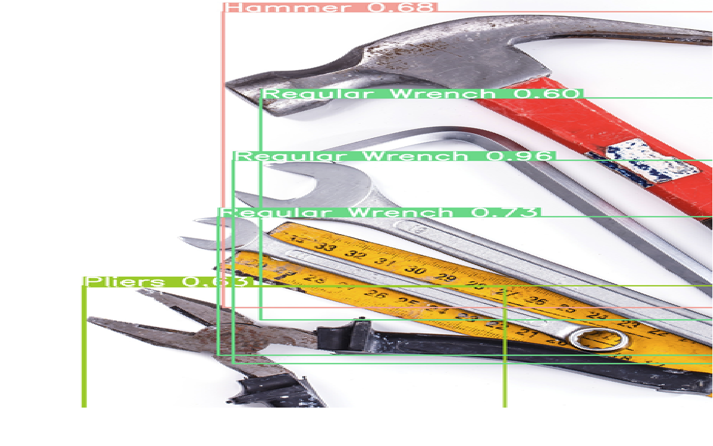

# Tool Detection Project

This repository contains an implementation of a tool detection task using YOLOv8. The project involves training models with 40 and 60 epochs and comparing their performance using various metrics.

## Features
- **Training**: Two models trained for 40 epochs and 60 epochs respectively.
- **Comparison**: Performance comparison based on evaluation metrics.
- **Testing**: Jupyter notebook for testing the trained models on new data.

## Project Structure
```
Tool-Detection/
├── data/                         # Evaluation results for comparison
├── notebooks/                    # Jupyter notebooks for training and testing
├── models/                       # Trained YOLOv8 models
├── README.md                     # Project overview and instructions
├── requirements.txt              # Python dependencies
└── LICENSE                       # License information
```

## Results Comparison

| Metric         | 40 Epochs | 60 Epochs |
|----------------|-----------|-----------|
| **Precision**  | TBD       | TBD       |
| **Recall**     | TBD       | TBD       |
| **mAP@50**     | TBD       | TBD       |

## Example Detection
Below is an example of the tool detection results from the project:



## How to Use

1. Clone the repository:
   ```bash
   git clone https://github.com/yourusername/Tool-Detection.git
   ```

2. Install dependencies:
   ```bash
   pip install -r requirements.txt
   ```

3. Open and run the notebooks for training and evaluation:
   ```bash
   jupyter notebook notebooks/ToolsDetection_40epoch.ipynb
   ```

## Acknowledgments

This project was developed to compare training strategies and explore tool detection using YOLOv8.

## License

This project is licensed under [Your Preferred License].
